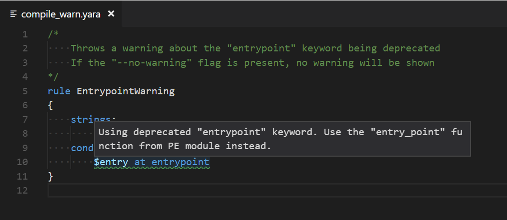
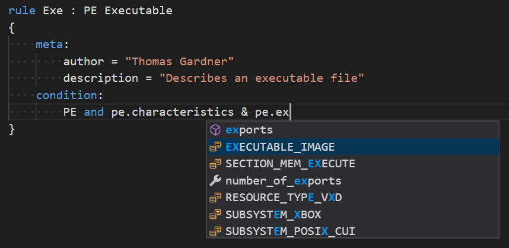

# YARA for Visual Studio Code
Language support for the YARA pattern matching language

## Features

### Syntax Highlighting


### Diagnostics
If the `yarac` tool is installed locally, this extension can draw diagnotics (red & green squigglies) directly onto rules



By default, diagnostics are redrawn on each file save, but this can be turned off with the configuration setting
```
"yara.compileOnSave": "off"
```

The `yarac` tool is assumed to be in the local $PATH by default, but a custom path can be provided with the configuration setting
```
"yara.installPath": "<directory_storing_binary>"
```

### Definition Provider and Peeking
Allows peeking and Ctrl+clicking to jump to a rule definition. This applies to both rule names and variables


### Reference Provider
Shows the locations of a given symbol (rule name, variable, constant, etc.)


### Code Completion
Provides completion suggestions for standard YARA modules, including `pe`, `elf`, `math`, and all the others available in the official documentation: http://yara.readthedocs.io/en/v3.7.0/modules.html



### Snippets
Includes:
* `rule:` skeleton
* `import` statement completion
* `strings:` section skeleton
* `meta:` section skeleton

## Problems?
If you encounter an issue with the syntax, feel free to create an issue or pull request!
Alternatively, check out some of the YARA syntaxes for Sublime and Atom, or the one bundled with YARA itself.
They use the same syntax engine as VSCode and should work the same way.

## YARA Documentation
https://yara.readthedocs.io/
